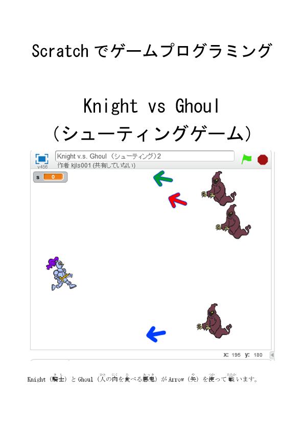

# Knight vs Ghoul（シューティングゲーム）

## 説明：
Knight（騎士）とGhoul（人の肉を食べる悪鬼）がArrow（矢）を使って戦います。  
プログラミングの難易度は「むずかしい」です。  

## 表紙：

## ダウンロード：
[Knight_vs_Ghoulマニュアルa](Knight_vs_Ghoulマニュアルa.docx)  

## 作成：
CoderDojo Mito

## 利用条件：
 この 作品 は <a rel="license" href="http://creativecommons.org/licenses/by/4.0/">クリエイティブ・コモンズ 表示 4.0 国際 ライセンス</a>の下に提供されています。

## 備考
このマニュアルで使用しているゲームは、  
CoderDojo Japan公式ブック  
Scratch(スクラッチ)でつくる! たのしむ!　プログラミング道場  
の内容を参考にして作成いたしました。  
