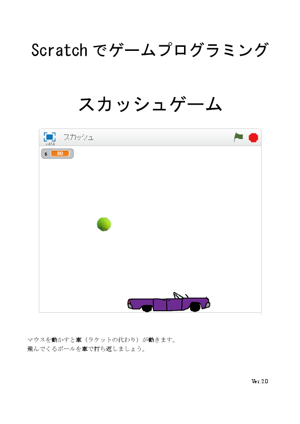

# スカッシュゲーム

## 説明：
マウスでラケット（車）を操作し、ボールを打ち返します。  
プログラミングの難易度は「かんたん」です。  

## 表紙：
  

## ダウンロード：
[スカッシュマニュアルv2](スカッシュマニュアルv2.docx)  

## 作成：
CoderDojo Mito

## 利用条件：
 この 作品 は <a rel="license" href="http://creativecommons.org/licenses/by/4.0/">クリエイティブ・コモンズ 表示 4.0 国際 ライセンス</a>の下に提供されています。
