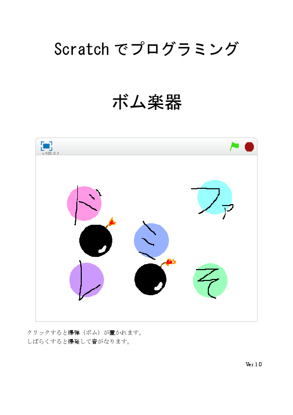

# ボム楽器

## 説明：
クリックすると爆弾（ボム）が置かれます。  
しばらくすると爆発して音がなります。  
プログラミングの難易度は「ふつう」です。  

## 表紙：

## ダウンロード：
[ボム楽器マニュアル](ボム楽器マニュアル.docx)  
[ボム1.svg](ボム1.svg)  
[ボム2.svg](ボム2.svg)  
[ボム3.svg](ボム3.svg)  

## 作成：
CoderDojo Mito

## 利用条件：
 この 作品 は <a rel="license" href="http://creativecommons.org/licenses/by/4.0/">クリエイティブ・コモンズ 表示 4.0 国際 ライセンス</a>の下に提供されています。
